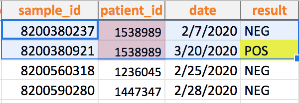

# Importing Lab Sample Data to Go.Data
For many Go.Data implementers, lab results data will be the starting reference point when implementing a new Go.Data instance. This sample data will need to be first be transformed to align with the Go.Data data model, where `Case` and `Contact` records must first be created to track individual beneficiary details. Once these individual records are created, then related `Lab Results` data can be imported. 

---
**Use Case:**
**#3.** _As a Go.Data user, I would like to directly integrate lab datasets so that I can more quickly and securely register Contact and Case records to ensure data quality and save time on data entry._

---

### Standard Import Process
Typically a lab will provide export of `sample`/ `labResults` data like [this example](https://docs.google.com/spreadsheets/d/1xwqHwjb8aRwycRzz5Sk0MLtoOwSc6UhqLolV4ylcHLc/edit?usp=sharing). In this data source, there might be multiple `Sample` results for 1 unique individual. 

Converting the `sample` dataset to individual `Cases` or `Contact` records with `labResults` records is required to align a flat data source with the Go.Data data model. To import this data to the Go.Data system, the user will need to...

1. Analyze the dataset to construct unique `Case` and `Contact` records for every unique individual. Consider...

* 1.a. Is there an available individual unique id (e.g., `national_id`) in the data source that can be imported to Go.Data? 
* 1.b. If not, can you construct a new unique id for individual records? 

2. Determine the `unique identifier` for every individual record. 
- If this lab data is related to individuals already registered in Go.Data, consider what shared external identifier you can use to look-up existing records to prevent duplicates. 
- If this is a new import and you're creating Go.Data individual `Case` or `Contact` records for the first time, consider what identifiers you want to assign to these records on import. 

Consider...
* 2.a. Will you import a lab-provided custom Id or standard identifier (e.g., `nationalId`) from the lab dataset? (You can then set this as the Go.Data Case Id as by masking the CaseId as `*`, or import this Id to the `Document` or another `identifier` custom variable in the Questionnaire of that record.)
* 2.b. Or will you have Go.Data generate a new custom Id (e.g., `case_id: 'CASE-00001'`) based on some standard naming convention and autonumber? (You can define this unique identifier naming scheme when you configure a new `Outbreak`.)

_→ See the [Unique Identifiers](https://worldhealthorganization.github.io/godata/unique-identifiers/) documentation for Go.Data-specific additional guidance on identifiers._

3. Import the individual records to Go.Data using the standard `import` wizard or the API (e.g., `POST /outbreak/{id}/cases`). 

4. Then prepare to import related `labResults`. Organize the lab data to link every lab `sample` record to an individual person record. 
- [See this Case - Lab Results](https://docs.google.com/spreadsheets/d/1Z2Duhg43FrIzs63xq3JWcqAXZ16dUYUI30V4D2N3RFg/edit#gid=1067465781) import template where every row is a lab test result record linked to an individual `Case` record. 
- If the individual's `unique identifier` is not already included in the lab dataset, you may need to export the `Cases` imported in step `3` to extract the newly assigned `case_id` (e.g., `CASE-00001`) or the Go.Data global `id` (e.g., `e2d87af7-fde2-4ea6-a2be-9dc0cc03c2cd`). Then you can include this identifier as a column in your `Lab Results` import (see `column B` in template) so that every `sample` record is linked to an existing individual Go.Data `Case` record. 

5. Now import the `labResults` records to Go.Data using the standard `import` file wizard or via the API. 

Note: If importing `labResults` via the API, you will need to extract the Go.Data global `id` and not the mask `case_id` (e.g., `3b5554d7-2c19-41d0-b9af-475ad25a382b`) to successfully import...
`POST '/outbreaks/{id}/cases/{fk}/lab-results'` where `{fk}` is the case foreign key `id` that you will include in your import request. 

### Implementation Resources
1. See [example import templates](https://drive.google.com/drive/folders/1H0dL6wwkRomNPdugFcUO0Ft0VbLwcxYm). 
2. See the section on [Unique Identifiers](https://worldhealthorganization.github.io/godata/unique-identifiers/) to support with resource matching during data imports. 
